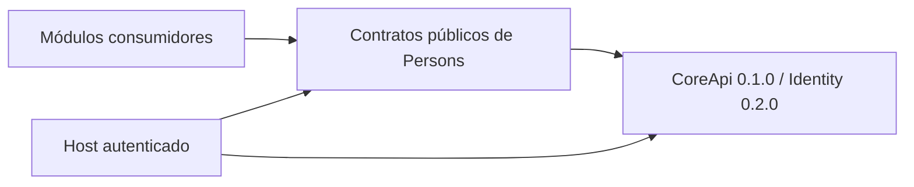

# Arquitectura de Persons — propuesta para revisión

Estado: diseño previo; no contrato implementado ni decisión humana inferida.
Fuente funcional: pedido vigente y conversación recuperada. Hechos de Core en
[inspección](inspeccion-fundacion.md). Decisiones abiertas no impiden documentar
alternativas, pero sí impiden aprobar una spec que dependa de ellas.

## Límites y dependencias

Core posee Organization, Location (nombre público real de sede), UserProfile,
membership, roles, permisos y autorización. Identity es el concepto de acceso;
el modelo real de Core usa UserProfile y external_subject. Persons no crea
usuarios, contraseñas, sesiones, roles ni membership al crear una persona.

Person representa exclusivamente a una persona física. Sus datos generales,
identificadores, contactos y vínculo organizacional pertenecen a COMMON.
Paciente, profesional, Lead, cliente, empleado y otras especialidades son
entidades de sus módulos, con ID y ciclo de vida propios. Persons no incluye
columnas ni enums de esos roles ni importa los módulos consumidores.

La referencia a Person de un consumidor es lógica y tenant-aware. No exige FK
SQL hacia tablas privadas: el consumidor valida mediante la API pública de
Persons. Su unicidad típica es (organization_id, person_id) por especialidad;
la regla final pertenece al consumidor. No se modifica ninguna vertical.

## ADR-P01: aislamiento y alcance de identidad física

Decisión confirmada por el usuario el 2026-09-20: Person es propiedad de una Organization. Tenant equivale a
organization_id, como en Core; no se crea un tenant_id paralelo. La misma
persona física puede tener registros independientes en dos tenants. Eso no
es un duplicado local; fusionarlos implicaría compartir datos sin autorización.

Alternativa considerada: identidad global y permisos por vínculo. Se difiere
porque requiere matching entre tenants, consentimiento, ownership de cambios,
revocación, propagación y resolución de conflictos. Un enlace a otra
organización nunca basta para dar visibilidad. No hay búsqueda global,
deduplicación global, traslado automático ni API de intercambio en la primera etapa.

Confirmación recibida: «Sí: Personas por organización, sin compartir entre tenants».
Un futuro intercambio requerirá rediseñar P01 y las claves antes de migraciones. No introducir una
tabla global silenciosamente para facilitar futuras verticales.

## ADR-P02: stack y composición

Propuesta técnica: biblioteca Python >=3.12, fachada independiente del
transporte, dominio/aplicación/puertos/adaptadores. Encaja con Core sin agregar
un servidor HTTP ni framework por adelantado. Persistencia PostgreSQL detrás
de un puerto es candidata, no desplegada ni habilitada en este bootstrap.

El host suministra una instancia pública CoreApi 0.2.1 y un contexto confiable.
Persons importa sólo CoreApi y errores públicos; no compone CoreService ni
SupabaseCoreStore ni accede a CoreApi.service. El host resuelve sujeto de sesión
a user_id. Core recibe person_id como referencia opaca y nunca el objeto Person.

Fijar la primera prueba de compatibilidad al SHA de release inspeccionado.
No depender de develop, rutas absolutas locales ni versiones flotantes. Antes
de distribuir, verificar wheel/digest y canal de instalación. No se publica
pyproject de producto fingiendo una dependencia ya validada.

## ADR-P03: autorización y acceso a datos

Cada caso de uso llama CoreApi.authorize con user_id, organization_id,
permiso y location_id opcional antes de buscar por ID o resolver duplicados.
El contexto proviene del host autenticado, nunca de actor_id en un formulario.
Toda consulta/escritura agrega organization_id, incluso por UUID, y verifica
consistencia del contexto devuelto por Core y contract_version.

Denegación, excepción, versión no soportada o proveedor indisponible fallan
cerrado. No se cachean decisiones positivas entre peticiones. Un UUID válido
no demuestra autorización. No se expone diferencia entre ID ajeno e inexistente.
location_id no cambia el dueño de Person: es contexto adicional. No se promete
aislamiento por sede de los datos generales sin una regla de negocio explícita.

Los permisos propuestos están en contratos-persons.md. Se registran por
provisioning confiable de Core; no se duplican evaluadores de roles en Persons.
La implementación exige estados activos y revocaciones evaluados por Core en
cada llamada; Persons no duplica esa política ni cachea decisiones positivas.

## ADR-P04: auditoría y privacidad

Core ya audita decisiones de autorización. Persons necesita además traza de
operaciones sobre sus propios agregados: actor, organization_id, acción,
entity_id, hora UTC, correlation_id, versión y resultado. No registrar nombres,
documentos completos, teléfonos, email, credenciales ni valores anteriores de PII.
Una denegación tampoco debe revelar identidad o datos del tenant ajeno.

Propuesta mínima: registro append-only de auditoría de dominio en la misma
transacción Persons, mediante puerto propio; no replica seguridad ni auditoría
interna de Core. Si GI exige un colector común, proponer su contrato en Core
separadamente. No invocar AuditSink interno como si fuera público. Outbox sólo
si se decide transporte externo; no se agrega un broker preventivamente.

Las escrituras y su auditoría confirman juntas; error de auditoría revierte la
mutación. Lecturas sensibles generan traza sin PII, con política de fallos
definida antes de producción. Retención, borrado/anonimización y acceso al log
requieren definición funcional/legal; no se inventan plazos ni consentimiento.

## Exclusiones iniciales

Sin merge automático, endpoint global, perfil clínico/jurídico/comercial,
credenciales, replicación de membership, sincronización automática con Core,
despliegue ni migración en un Supabase real. Cada exclusión delimita la primera
fundación, no elimina el requisito futuro del producto.
